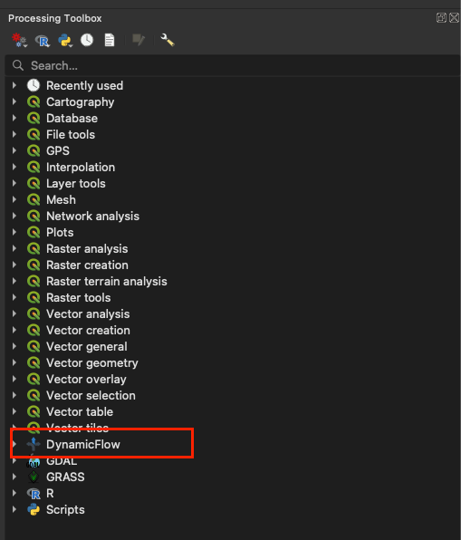

# Dynamic Flow

## Introduction 
Dynamic Flow is a QGIS plugin to estimate the spatio-temporal 3D gradient flow from the point observation of the attributes values such as aggregated cell-phone mobility data. The algorithm was based on the image-processing techniques which provided a two-step 3D gradient method to extract the movement features. The first step is to estimate the initial movement pattern in each spatiotemporal grid, and then to estimate the accumulated movement pattern within a time period around a geographical grid. This method can be applied adaptively to multi-scale spatiotemporal grid data. Using geospatial visualization methods, estimated motion characteristics such as velocity and flow direction can be made intuitive and integrated with other multiscale geospatial data. 

#### Dynamic Flow Algorithm
The introduction of the algorithm: Bo-Cheng Lin, Ta-Chien Chan*, 2022, “Visualizing Population Mobility from Spatio-temporally Aggregated Mobile Phone Data via a 3D Gradient Approach”, TRANSACTIONS IN GIS, https://doi.org/10.1111/tgis.13008 

#### Tutorial Data
Bergroth, C., Järv, O., Tenkanen, H., Manninen, M., Toivonen, T., 2022. A 24-hour population distribution dataset based on mobile phone data from Helsinki Metropolitan Area, Finland. Scientific Data 9, 39. https://doi.org/10.1038/s41597-021-01113-4 (https://zenodo.org/records/4726996)

## Install plugin in QGIS
1. Open `QGIS` and go to `Plugins` -> `Manage and Install plugins` -> Search `Dynamic Flow` in `All plugins` and install.

2. You can also install from zipped file. After install `dynamic_flow.zip`. Open `QGIS` and go to `Plugins` -> `Manage and Install plugins` -> `Install from Zip` -> Select the downloaded zip folder and press `Install plugin`. 

If successfully install, the icon for the Dynamic Flow plugin will appear in the 'Processing Toolbox' panel.



#### Solution - Module 'geopandas' not found error
Please make sure that QGIS has installed the Python library "geopandas". If you encounter the following error during installation (ModuleNotFoundError: No module named 'geopandas'), then you need to install geopandas using the following method:


#### Install geopandas library - Windows
Open `OSGeo4W Shell` Shell installed with QGIS as `Administrator` and type:
```sh
 $ python -m pip install --upgrade pip
 $ python -m pip install geopandas
```